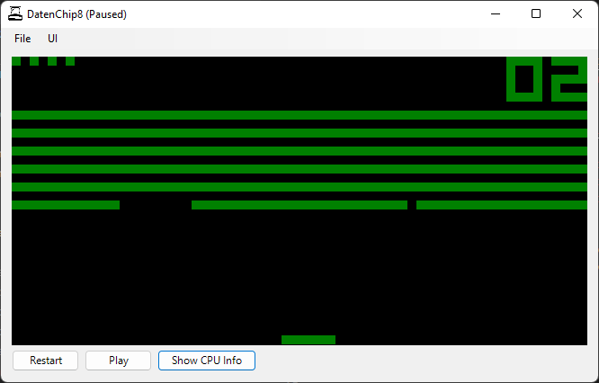
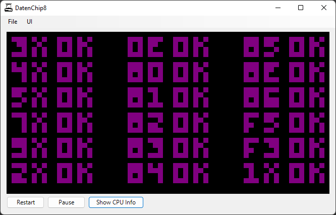
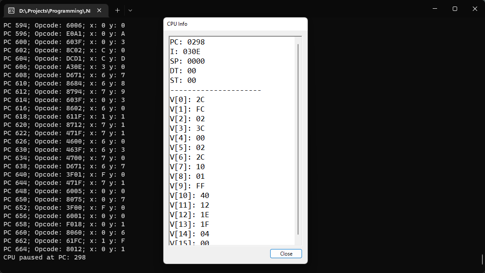

# DatenChip8
A CHIP-8 "Emulator" (read: interpreter), written entirely in C#.

## Background 
[CHIP-8](https://en.wikipedia.org/wiki/CHIP-8) is a programming language from the late 1970s, used to runs games on it's own CHIP-8 virtual machine. It's well-known for it's overall simplicity and ease of development, and as such, [it's still used today](https://johnearnest.github.io/chip8Archive/).

CHIP-8 is also well known as being a gateway into understanding the mechanics and concepts behind emulation, and is often recommended as a starting point when getting into this area of programming. 

As I'm interesting in eventually developing an original DMG GameBoy emulator, I thought this would be an interesting project to undertake to learn the basics. 

## Features 
- Full instruction set support
- Colour display output
- An (extremely rudimentary) debugger

## Usage
Simply load up `DatenChip8.exe` and select the ROM you want to use via the `Load ROM` option in the `File` dropdown menu. 

The CHIP-8's unique control layout has been adapted to be much easier to use, with the keys mapped as follows:

<table>
    <thead>
        <td>Original CHIP-8 Layout</td>
        <td>DatenChip8 Layout</td>
    </thead>
    <tbody>
        <tr>
            <td>
                <table>
                    <tbody>
                        <tr>
                            <td>1</td>
                            <td>2</td>
                            <td>3</td>
                            <td>C</td>
                        </tr>
                        <tr>
                            <td>4</td>
                            <td>5</td>
                            <td>6</td>
                            <td>D</td>
                        </tr>
                        <tr>
                            <td>7</td>
                            <td>8</td>
                            <td>9</td>
                            <td>E</td>
                        </tr>
                        <tr>
                            <td>A</td>
                            <td>0</td>
                            <td>B</td>
                            <td>F</td>
                        </tr>
                    </tbody>
                </table>
            </td>
            <td>
                 <table>
                    <tbody>
                        <tr>
                            <td>1</td>
                            <td>2</td>
                            <td>3</td>
                            <td>4</td>
                        </tr>
                        <tr>
                            <td>Q</td>
                            <td>W</td>
                            <td>E</td>
                            <td>R</td>
                        </tr>
                        <tr>
                            <td>A</td>
                            <td>S</td>
                            <td>D</td>
                            <td>F</td>
                        </tr>
                        <tr>
                            <td>Z</td>
                            <td>X</td>
                            <td>C</td>
                            <td>V</td>
                        </tr>
                    </tbody>
                </table>
            </td>
        </tr>
    </tbody>
</table>

Please note that this won't change what appears in ROMS (i.e. some games may ask for 'C' as your input, in which case you will need to press 4)

## Screenshots

## License
[Unlicense](https://choosealicense.com/licenses/unlicense/)
